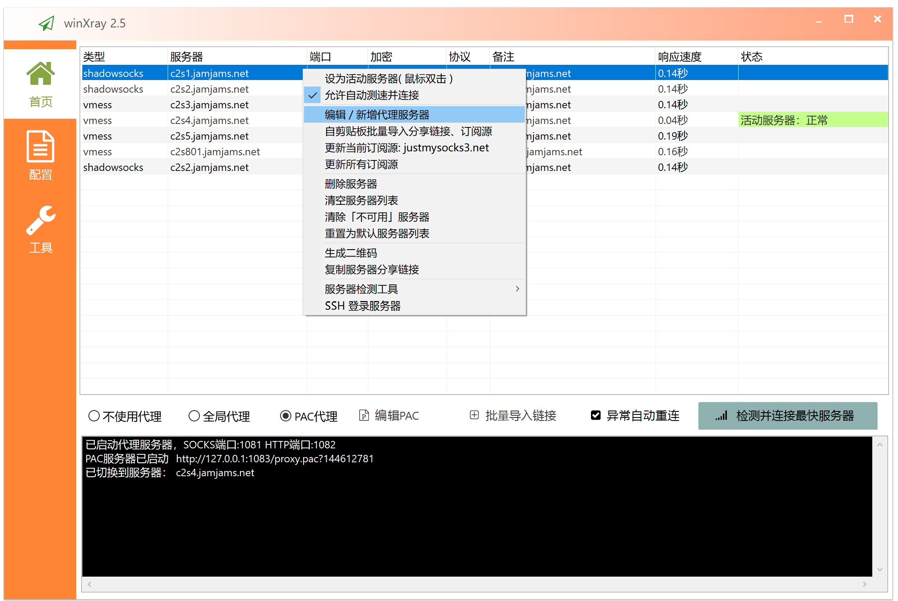
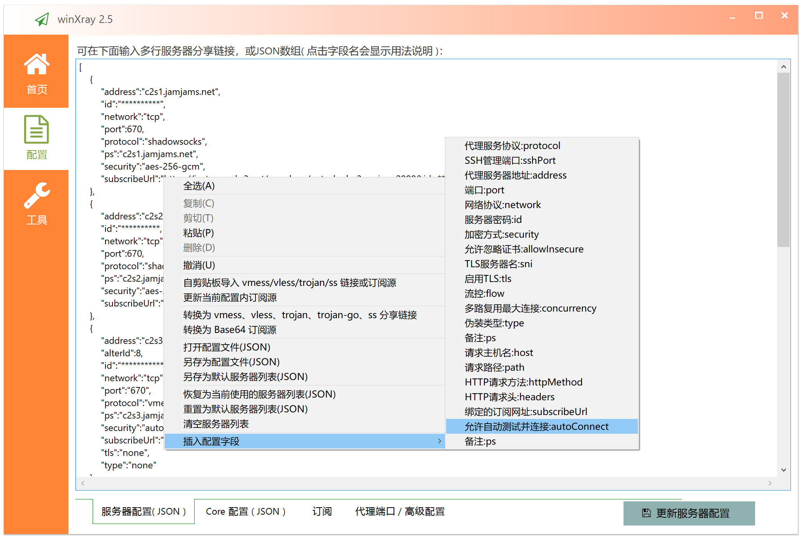
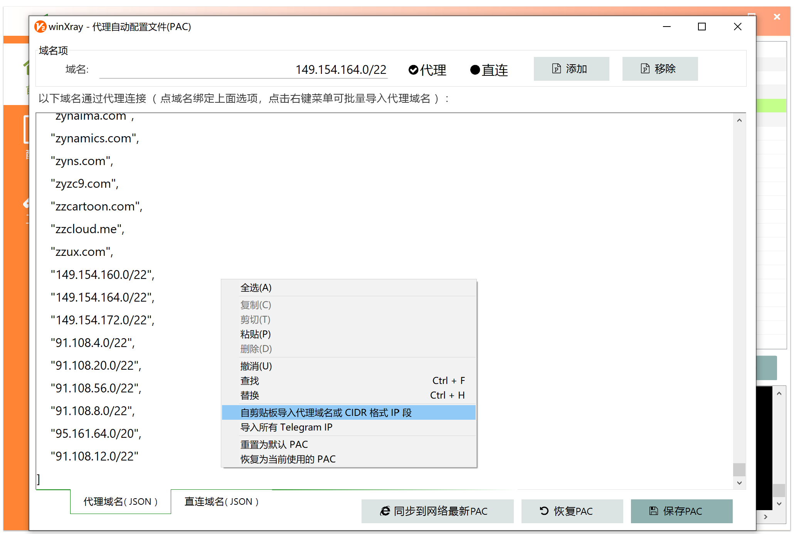

# winXray 
本软件源码已贡献到公共领域并放弃版权，源码可使用 [aardio（开发环境仅6.5MB）](http://www.aardio.com) 编译生成单文件绿色EXE( 不需要.Net等任何外部运行库 ），**[点这里下载](https://raw.githubusercontent.com/winXray/winXray/master/release/winXray.7z)** （ [64位版本](https://raw.githubusercontent.com/winXray/winXray/master/release/winXray.7z) / [32位版本](https://raw.githubusercontent.com/winXray/winXray/master/release/winXray32.7z) ），解压即可直接使用( 仅  **[5.0MB](https://raw.githubusercontent.com/winXray/winXray/master/release/winXray.7z)** - 已自带 Xray-core）。

winXray[:loud_sound:](http://dict.youdao.com/dictvoice?audio=winxray&type=2) 是一个简洁稳定的 [Xray/V2Ray(vmess/vless/xtls)、Shadowsocks、Trojan](https://github.com/XTLS/Xray-core) 通用客户端（Windows系统），可自动检测并连接访问速度最快的代理服务器。服务器连接异常时可以自动更换代理服务器 - 再也不用担心服务器抽风了。winXray 也提供一键安装 XRay(V2Ray、Shadowsocks、Trojan) 服务器工具。  
  
这里说明一下，简洁不等于功能弱。一般人只是为了上个网加个速用不上太复杂的小众功能。太复杂同时就会带来不稳定、且不必要的占用资源并同时降低性能，所以 winXray 做了大量的优化、精简，但是并没有减少主要的、必要的代理服务器功能。  
  

  
最新公益服务器列表
  <pre>
vless://bf4a6c2b-db1b-57de-f45a-364aa254d1f7@z.vulvpstech.xyz:443/?flow=xtls-rprx-direct&host=z.vulvpstech.xyz&tls=xtls#%E7%BE%8E%E5%9B%BD%E8%A5%BF%E9%9B%85%E5%9B%BE_XTLS%2FDirect
vless://904da8f7-a5af-3c34-3f3d-c3b2ea59bde8@q.vulvpstech.xyz:443/?host=q.vulvpstech.xyz&tls=xtls#%E7%BE%8E%E5%9B%BD%E6%B4%9B%E6%9D%89%E7%9F%B6_XTLS%2FDirect
</pre>
    

  
vless 分享链接格式说明：
  <pre>
vless目前没有分享链接标准，这会给我们带来较大的麻烦，所以 win2ray 制定了一个分享链接格式，  
其实这种格式应当尽可能的简单，我个人觉得 vmess 的链接就把简单的事搞复杂了，如发明了太多新名词以及莫名其妙不直观不必要的BASE64。
所以简洁直观、最少的说明文字是制定 vless分享链接格式 的唯一指导原则。

## 分享链接格式：
vless://服务器密码@域名或IP:端口?flow=&tls=&network=&security=&sni=&host=&path=&allowInsecure=&alpn=&disableSessionResumption=#服务器描述

?后的所有URL参数遵守URL规范进行URL编码，  
URL参数中的所有字段基本都是可选字段，字段名与JSON配置使用的字段名完全一致。  
各参数字段的具体作用请参考配置编辑器说明（鼠标点字段名可以看到提示）以及Xray/V2ray官方文档。

个别字段的默认值下面解释一下：
 
### flow 参数
流控参数，可选，不指定时默认值为 "xtls-rprx-direct",

### tls 参数
可选参数为 "tls"或 "xtls"，不指定时默认值为 "tls"

## host 参数
伪装域名，不指定时使用服务器域名或IP

## sni 参数
TLS服务器名，不指定时使用host字段值，如果host也没有指定，使用服务器域名或IP
</pre>
    

之前我用过很多代理客户端，经常用一会就挂掉了，有些测试很久才找到下一个可用的服务器，有时怎么切换都不行，一定要把整个软件退出重启才能恢复。而且在WIN10上都有相同的BUG:PAC代理用一段时间就会卡死( winXray已经通过自行实现PAC服务器解决了这个问题 )，其实这些软件里提供的很多功能我并不需要，我只想愉快地用下 google 找点技术资料提升工作效率。但是在网上找了很久都没找到适合的软件，于是决定自己动手写一个，还好用 aardio 写软件的速度很快 - 大概用了几个小时就完成了 winXray 的主要代码，改进了几个版本以后就很稳定了，**我自己用了 winXray  几个月再也没有遇到 google 抽风访问不了的问题**。    

winXray支持批量导入 vless、vmess、ss、trojan、trojan-go …… 等格式的分享链接，  
也可以导入通用订阅链接，以及 base 64、json …… 等不同格式的服务器配置。

**小技巧: JSON里点击任意字段都会显示该字段的用法说明。**

可选在 ["/xray-core/winXray-default-servers.json"](./xray-core/winXray-default-servers.json) 文件中添加默认服务器配置（生成EXE后默认配置自动嵌入到EXE文件，可选删除该文件,也可以继续使用该文件覆盖EXE自带的默认服务器列表）。

**小技巧: PAC编辑器里点击任意域名都会自动关联到单选框，可以直接切换代理或直连。**

软件首次运行时会在当前目录查找 "./xray-core/xray.exe"   
发行文件仅需要 "./winXray.exe"，可选带上 "./xray-core/" 目录（ 如果没有找到会自动到v2ray官网下载，不过没有代理服务器下载有时候非常慢 )。

